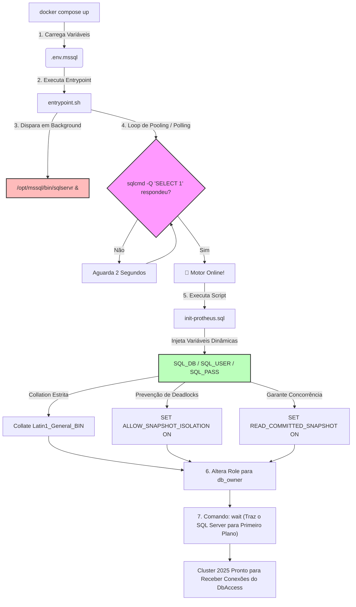

# 🐳 TOTVS Protheus - Cluster Microsoft SQL Server 2025

Este repositório é um componente isolado da arquitetura TOTVS Protheus Modern DevOps [https://github.com/rodrigomicrosiga-devops/totvs-protheus-modern-devops], e isola e automatiza a camada de banco de dados relacionais **Microsoft SQL Server 2025** (imagem base Ubuntu) customizada especificamente para suportar o ecossistema do ERP TOTVS Protheus dentro da organização **`rodrigomicrosiga-devops`**. 

---

## 🏗️ Arquitetura de Inicialização Autocontida (Asynchronous Background Bootstrap)

Diferente de abordagens tradicionais que utilizam containers auxiliares (helpers) para injetar esquemas de banco de dados, este artefato adota uma arquitetura autocontida através de um `entrypoint.sh` assíncrono. O motor do SQL Server é despachado em background, enquanto um laço de resiliência local monitora a disponibilidade da porta de conexões para disparar o utilitário `sqlcmd` nativo com as variáveis injetadas via `.env`.



### ⚙️ Diretivas Técnicas e Otimizações de Concorrência

Para mitigar os gargalos clássicos do Protheus em bancos de dados relacionais e garantir compatibilidade estrita com os drivers ODBC (`msodbcsql18`), o script de automação força as seguintes políticas:

* **Colation Nativa**: `Latin1_General_BIN`
* **Isolamento de Snapshot** (`ALLOW_SNAPSHOT_ISOLATION`): Ativado para permitir que leituras de tabelas operacionais acessem versões anteriores de registros modificados, sem sofrer bloqueios por transações abertas de escrita.
* **Leitura Confirmada por Snapshot** (`READ_COMMITTED_SNAPSHOT`): Ativado em nível de banco de dados para eliminar de forma cirúrgica os cenários crônicos de Deadlocks inter-tabelas (SX1, SE1, SA1, etc.) no ERP.
* **Segurança Conectiva**: O `entrypoint.sh` injeta os parâmetros `-C` na execução do utilitário `sqlcmd` para forçar a confiança implícita nas novas cadeias rígidas de certificados autoassinados da versão 2025.

### 🚀 Como Executar o Cluster

Certifique-se de que o arquivo oculto `.env.mssql` esteja configurado localmente na raiz do projeto e execute:

```bash
# Construção local da imagem baseada no SQL Server 2025 e execução em background
docker compose --env-file .env.mssql up --build -d
```